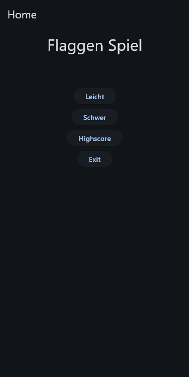
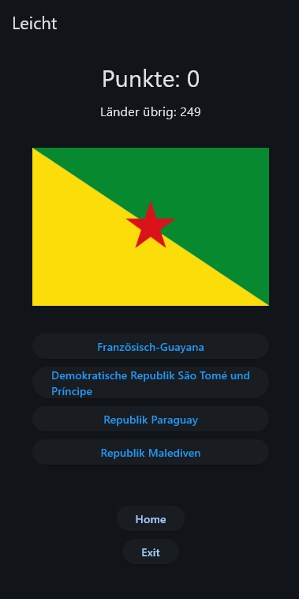
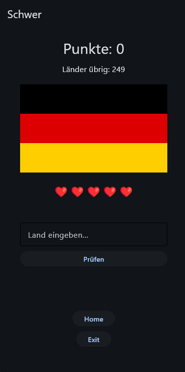
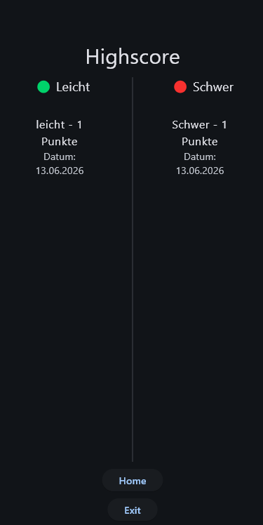

# 🌍 Flaggenspiel


## Run the app


---

## 🎮 Features

- **Leicht** – Wähle den richtigen Ländernamen aus 4 Antworten
- **Schwer** – Tippe den Ländernamen selbst ein (mit 5 Versuchen)
- **Highscore** – Bestenliste getrennt nach Schwierigkeitsgrad (Top 10)
- Sonderzeichen werden automatisch erkannt (z.B. `Cote d'Ivoire` statt `Côte d'Ivoire`)
- Länderanzahl-Anzeige während des Spiels
- Speichern des Highscores mit Name und Datum

---

## 📸 Screenshots

| Home | Leicht | Schwer | Highscore |
|------|--------|--------|-----------|
|  |  |  |  |

---

## 🛠️ Installation

### Voraussetzungen

- Python 3.10 oder höher
- pip

### Abhängigkeiten installieren

```bash
pip install -r requirements.txt
```

### Daten vorbereiten

> ⚠️ Diese Schritte müssen **vor dem ersten Start** ausgeführt werden!

1. **Länderdaten laden** – Erstellt die `countries.json` mit allen Länderinformationen:
   ```bash
   python country_api.py
   ```

2. **Flaggen herunterladen** – Lädt alle Flaggen als `.png` in den `flags/` Ordner:
   ```bash
   python flag_loader.py
   ```

3. **App starten:**
   ```bash
   flet run main.py
   ```

---

## 📁 Projektstruktur

```
FlaggenSpiel/
│
├── src/                        
│   ├── assets/                 # Assets Ordner
│   ├── app.log                 # Log-Datei (automatisch erstellt)
│   ├── countries.json          # Länderdaten (von country_api.py erstellt)
│   ├── country.py              # Country Klasse
│   ├── highscore_leicht.json   # Highscore Leicht (automatisch erstellt)
│   ├── highscore_schwer.json   # Highscore Schwer (automatisch erstellt)
│   ├── icon.png                # App Icon (src/)
│   ├── logic_handler.py        # Laden der Länderdaten
│   └── main.py                 # Haupt-App (UI & Logik)
│
├── .gitignore
├── country_api.py              # Skript zum Abrufen der Länderdaten
├── flag_loader.py              # Skript zum Herunterladen der Flaggen
├── main.spec
├── README.md
└── requirements.txt
```

---

## 📱 App bauen

> Für alle Build-Befehle muss Flutter installiert sein. Siehe [Flutter Installation](https://docs.flutter.dev/get-started/install).

### Android

```bash
flet build apk -v
```

Für mehr Details zum Signieren: [Android Packaging Guide](https://flet.dev/docs/publish/android/)

### iOS

```bash
flet build ipa -v
```

Für mehr Details zum Signieren: [iOS Packaging Guide](https://flet.dev/docs/publish/ios/)

### macOS

```bash
flet build macos -v
```

Für mehr Details: [macOS Packaging Guide](https://flet.dev/docs/publish/macos/)

### Linux

```bash
flet build linux -v
```

Für mehr Details: [Linux Packaging Guide](https://flet.dev/docs/publish/linux/)

### Windows

```bash
flet build windows -v
```

Für mehr Details: [Windows Packaging Guide](https://flet.dev/docs/publish/windows/)

---

## 🐛 Fehlersuche

Alle Fehler werden automatisch in `app.log` gespeichert. Bei Problemen einfach diese Datei öffnen und nachschauen.

---

## 📄 Lizenz

Dieses Projekt ist privat.
